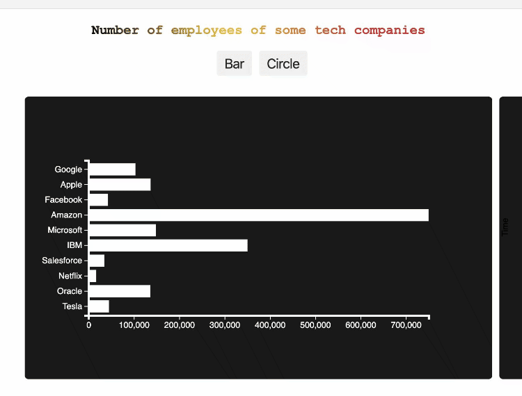
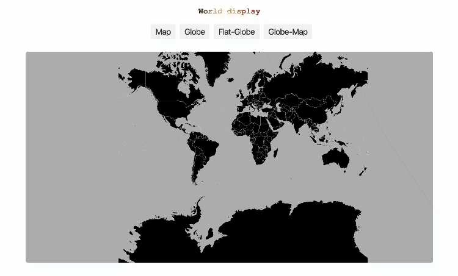
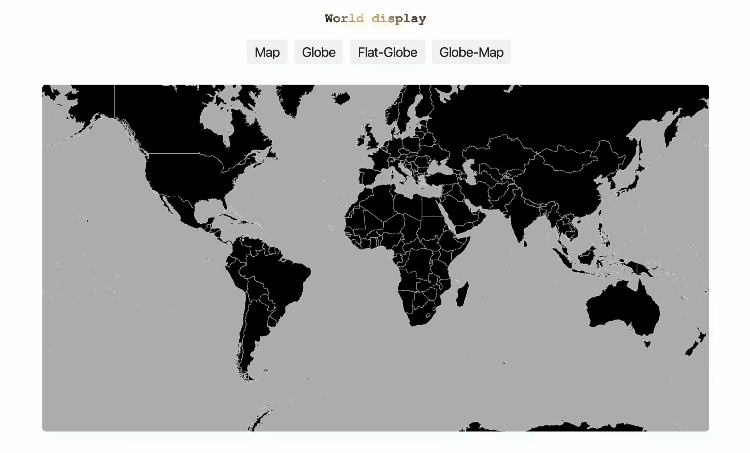

# D3 Gallery

A showcase of different data visualizations powered by D3.js!

[Take a look!](https://shmily40686.github.io/d3-tech-companies/)

## Background and Overview

D3 Gallery was built using:

  * D3
  
## Overview and Highlights 

### Bar graph/ Scatter plot
 * Displays the number of employees for some tech companies
 * Changes to a scatter plot when "Circle" button is clicked
 

 
### Line graph/ Area chart
 * Displays the number of stock volume for some tech companies
 * Changes to an area chart when the "Area" button is clicked
 * Displays different data when a different company is selected
 

 
### World display
 * Displays the countries in the world
 * Offers 4 different ways to view the world
 * Zoom in or out by scrolling
 * Displays the country name when mousing over countries
 

 
### Tree display
 * Displays the relationship between Alphabet and some of its subsidiaries
 * Highlights a relationship when mouse hovers over it
 * Zoom in or out by scrolling
 

### Graph display
 * Displays an interactive graph with color-coded nodes
 * Focuses on connections of node mouse hovers over
 * Zoom in or out by scrolling

## Created by
  [Xiaowen Ling](https://github.com/shmily40686)
